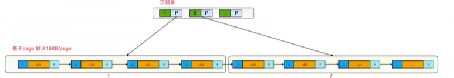
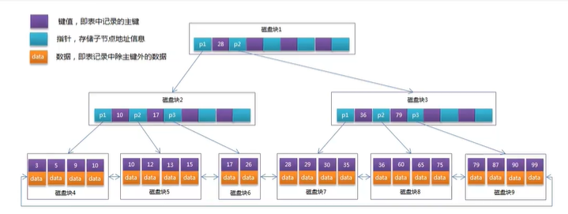
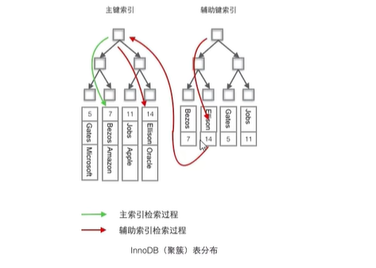
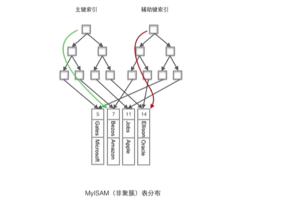

# 1 What is an index
 - Definition : 一种帮助mysql提高查询效率的数据结构
 - 索引就是一种数据结构

 - 索引的优点：
    1. 大大提高数据查询速度

 - 索引的缺点：
    1. 维护索引需要耗费数据库资源
    2. 索引需要占用磁盘空间
    3. 党对表的数据进行增删改时， 因为要维护索引，速度会受到影响

# 2 Classification of index
 - InnoDB
 - a. 主键索引
        设置为主键后数据库会自动建立索引， innodb为聚簇索引， 主键索引的索引值不能为空
 - b. 单值索引 单列索引 普通索引
        即一个索引只包含单个列，一个表可以有多个单列索引
 - c. 唯一索引
        索引列的值必须唯一， 但允许有空值 唯一索引索引列值可以存在null 但只能存在一个null
 - d. 复合索引
        即一个索引包括多个列

 -MyISAM
 - e. Full Text 全文索引 （My version5.7之前，只能用于MYISAM引擎）
        全文索引类型为FULLTEXT，在定义索引的列上支持值的全文查找，允许在这些索引列中插入重复值和空值。全文索引可以在CHAR、VARCHAR、TEXT类型列上创建。

# 3 Method of index
```sql
 1. 主键索引 自动创建

-- 主键索引是在建表时自动创建的
create table t_user(id varchar(20) primary key, name varchar(20));

-- 查看索引
show index from index;
```

```sql
 2.单列索引（普通索引 单值索引）
-- 建表时创建
create table t_user(id varchar(20) primary key, name varchar(20), key(name));
    '注意： 随表一起建立的索引索引名同列名一致'

-- 建表后创建
create index nameindex on t_user(name);

-- 删除索引
drop index 索引名 on 索引;
```sql

```sql
 3. 唯一索引
-- 建表时创建
create table t_user(id varchar(20) primary key, name varchar(20), unique(name)); 

-- 建表后创建
create unique index nameindex on t_user(name);
```

```sql
 4. 复合索引
-- 建表时创建
create table t_user(id varchar(20) primary key, name varchar(20), age int, key(name, age));

-- 建表后创建
create index nameageindex on t_user(name, age);
```
**复合索引查询原则：**
- name age bir    # 1.最左前缀原则  #2.mysql 引擎在查询为了更好利用索引 在查询过程中会动态调整查询字段顺序以便利用索引
  name bir age  可以利用索引
  name age bir  肯定可以
  age bir       不行
  bir age name  肯定可以
  age bir       不行

# 4 The underlying principle of indexing
 插入数据时无序，但内部会对主键进行排序.mysql 底层会为主键自动创建索引，创建索引后就对其进行排序

# 5 Optimize MySQL index
基于页的形式进行管理索引 ： 先比较页，直接去页目录里找，再去数据目录中找。


# 6 对应的数据结构为B+树数据结构

B+Tree 是 B-Tree 优化的数据结构， 使其更适合实现外存储索引结构， InnoDB存储引擎就是用B+Tree实现其索引结构。  
B-Tree中的每个节点不仅包含数据的key值，还有data值。而每一个页的存储空间是有限的，如果data数据较大时将会导致每个节点（即一个页）能存储的key数量很小，当存储的数据量很大时同样会导致B-Tree的深度较大，增大查询时的磁盘I/O次数，进而影响查询效率。在B+Tree中，所有数据记录节点都是按照键值大小顺序存放在同一层的叶子节点上，而非叶子节点上只存储key值信息，这样可以大大加大每个节点存储的key值数量，降低B+Tree的高度。  
**B+Tree相对于B-Tree有几点不同：**
    1. 非叶子节点只存储键值信息
    2. 所有叶子节点之间都有一个链指针
    3. 数据记录都存放在叶子节点中
    * InnoDB 存储引擎中页的大小为16KB， 一般表的主键类型为INT（占用4个字节）或BIGINT（占用8个字节），指针类型也一般为4或者8个字节，也就是说一个页（B+Tree中的一个节点）中大概存储16KB/（8B+8B）=1K个键值，也就是说一个深度为3的B+Tree索引可以维护10亿 条记录。  
    * 实际情况中每个节点可能不能填充满，因此在数据库中，B+Tree的高度一般在2~4层。mysql的InnoDB存储引擎在设计时将根节点常驻内存的，也就是说查找某一条键值的行记录最多只需要1·3次磁盘I/O操作。**因为顶层页常驻内存**

# 7 Cluster index and non cluster index
 - 聚簇索引： 将数据存储与索引放在了一块，索引结构的叶子节点保存了行数据
 - 非聚簇索引： 将数据与索引分开存储，索引结构的叶子节点指向了数据对应的位置
 注意：**在Innodb中，在聚簇索引之上创建的索引称之为辅助索引，非聚簇索引都是辅助索引，像复合索引、前缀索引、唯一索引。辅助索引叶子节点存储的不再是行的物理位置，而是主键值，辅助索引访问数据总是需要二次查找。**

1. InnoDB中
    * InnoDB使用的是聚簇索引，将主键组织到一颗B+树中，而行数据就存储在叶子节点上，若使用‘where id = 14’这样的条件查找主键，则按照B+树的检索算法即可查找到对应的叶节点，之后获取行数据。
    * 若对Name列进行条件搜索，则需要两个步骤：①在辅助索引B+树中检索Name， 到达其叶子节点获取对应的主键，②使用主键在主索引B+树中再执行一次B+树检索操作，最终到达叶子节点即可获取整行数据。**（重点在于通过其他键需要建立辅助索引）**
    * **聚簇索引默认是主键**，如果表中没有定义主键，InnoDB会选择一个**唯一且非空**的索引代替，如果没有这样的索引，InnoDB会**隐式定义一个主键（类似Oracle中的Rawld）**来作为聚簇索引。如果已经设置了主键为聚簇索引又希望再单独设置聚簇索引，必须先删除主键，然后添加我们想要的聚簇索引，最后恢复设置主键即可。
2. MYISAM中
    * MyISAM使用的是非聚簇索引，**非聚簇索引的两颗B+树看上去没什么不同**，结点的结构完全一致只是存储的内容不同而已，主键索引B+树的节点存储了主键，辅助建索引B+树存储了辅助键，表数据存储在独立的地方，这两颗B+树的叶子节点都使用一个地址只想真正的表数据，对于表数据来说，这两个键没有任何差别，由于**索引树是独立的，通过辅助建索引无需访问主键的索引树**。


# 8 使用聚簇索引的优势
 - Q：每次使用辅助索引检索都要经过两次B+树查找，看上去聚簇索引的效率明显要低于非聚簇索引，聚簇索引的优势在哪？
 - 1. 由于行数据和聚簇索引的叶子节点存储在一起，同一页会有多条数据，访问同一数据页不同行记录时，已经把页加载到了Buffer中（缓存器），再次访问时，会在内存中完成访问，不必访问磁盘，这样主键和行数一起被载入内存的，找到叶子节点就可以立刻进行将行数据返回了，如果按照主键Id来组织数据，获得数据更快。

 - 2. 辅助索引的叶子节点，存储主键值，而不是数据的存放地址，好处是当行数据发生变化时，索引树的节点也需要分裂变化；或者是我们需要查找的数据，在上一次IO读写的缓存中没有，需要发生一次新的IO操作时，可以避免对辅助索引的维护工作，只需要维护聚簇索引树就好了。另一个好处是，因为辅助索引存放的是主键值，减少了辅助索引占用的存储空间大小。（int比地址值占用的空间小）

# 9 聚簇索引需要注意什么
 - 当使用主键为聚簇索引时，主键最好不要使用uuid，因为uuid的值太过离散，不适合排序且可能出现新增加记录的uuid，会插入在索引树中间的位置，导致索引树调整复杂度变大，消耗更多时间。
 - 建议使用int类型的自增，方便排序并且默认在索引树的末尾增加主键值，对索引树的结构影响最小。而且，主键值占用的存储空间越大，辅助索引中保存的主键值也会跟着变大，占用存储空间，也会影响到IO操作读取到的数据量。

# 10 主键建议用自增的id
 - 聚簇索引的数据的物理存放顺序与索引顺序是一致的，即：只要索引是相邻的，那么对应的数据一定也是相邻的存放在磁盘上。如果主键不是自增id，那么可以想象，它会不断调整数据的物理地址、分页，当然也有一些措施来减少这些操作，但却无法避免。但，如果是自增的，它只需要一页一页地写，索引结构相对紧凑，磁盘碎片少，效率也高。

# 11 什么情况下无法利用索引
 1. 查询语句中使用 LIKE 关键字
        在查询语句中使用 LIKE 关键字进行查询时，如果匹配字符串的第一个字符为“%”，索引不会被使用。
 2. 查询语句中使用多列索引
        多列索引是在表的多个字段上创建一个索引，只有查询条件中使用了这些字段中的第一个字段，索引才会被使用。
 3. 查询语句中使用 OR 关键字
        查询语句只有 OR 关键字时，如果 OR 前后的两个条件的列都是索引，那么查询中将使用索引。如果 OR 前后有一个条件的列不是索引，那么查询将不使用索引。
