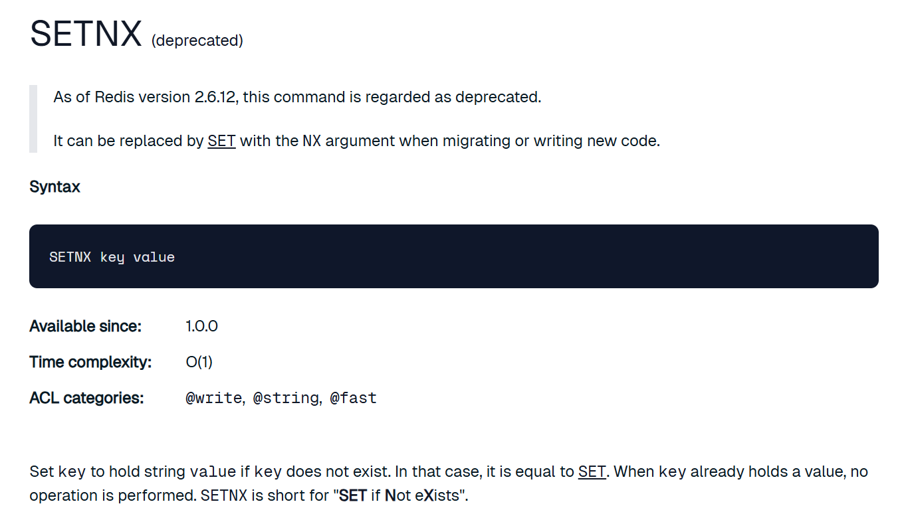
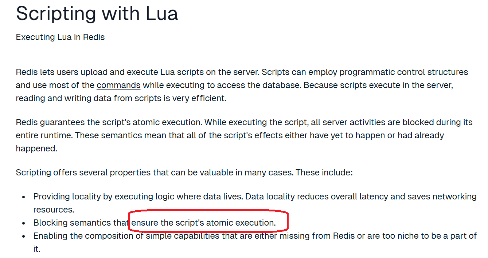

# ActivePolling

## 1 Background
在并发环境中，为了保证临界资源的数据一致性，我们常会使用到“锁”这个工具对临界资源进行保护，让混乱的并发访问行为退化为秩序的串行访问行为。  
在本地环境，由于多进程之间能够共享进程进程的数据，因此可以比较简单的实现进程内的互斥锁；然而在分布式场景中，有时我们需要跨越多个物理节点执行加锁操作，因此我们就需要依赖到类似于redis、mysql这样的状态存储组件，在此基础上实现所谓的“分布式锁”技术。

## 2 Core Nature
分布式锁应当具备以下几项核心性质：  
* 独占性：对于同一把锁，在同一时刻只能被一个取锁方占用  （base nature）
* 健壮性：既不能产生死锁（dead lock），假如某个占有锁的使用方因为宕机而无法主动执行解锁动作，锁应该也能被正常传承下去，被其他使用方所延续使用  
* 对称性：加锁和解锁的使用方必须为同一身份，不允许非法释放他人持有的分布式锁；  
* 高可用性：当提供分布式锁服务的基础组件中存在少量节点发生故障时，不应该影响到分布式锁服务的稳定性  

## 3 实现类型  
分布式锁根据其实现模型，可以被划分为两大类：  
* 主动轮询型：该模型类似于单机锁中的主动轮询 + CAS乐观锁模型，取锁方会持续对分布式锁发出尝试获取动作，如果锁已被占用则会不断发起重试，直到取锁成功为止。  
* watch回调型： 这里先不做引入。后面会专门介绍。  

# ActivePooling的实现思路

## 1 实现思路

**主动轮询型分布式锁的实现思路为:**    
* 针对于同一把分布式锁，使用同一条数据进行标识（redis：以同一个key对应的kv数据记录）  
* 假如在存储介质成功插入了该条数据（要求之前该key对应的数据不存在），则被认定为加锁成功  
* 把从存储介质中删除该条数据这一行为理解为释放锁操作  
* 倘若在插入该条数据时，发现数据已经存在（锁被他人持有），则持续轮询，直到数据被他人删除（他人释放锁），并由自身完成数据插入动作为止（取锁成功）  
* 由于是并发场景，需要保证 **（1）检查数据是否已经被插入 （2）数据不存在则插入数据**这两个步骤之间是原子化不可分的（在redis中是 set only if not exist —— SETNX操作）  

## 2 技术选型
实现主动轮询型分布式锁时，我们常用的组件包括 redis 和 mysql.

**（1）redis**
在实现主动轮询型分布式锁时，redis 算得上是大家最常用的组件.本文以redis为例，进行主动轮询型分布式锁的实践介绍.

redis基于内存实现数据的存储，所以足够高效轻便。此外，redis基于单线程模型完成数据处理工作，支持SETNX原子指令（set only if not exist），能够很方便的支持分布式锁的加锁操作。  
setnx操作已经被弃置了，官方推荐大家使用set指令并附加nx参数来实现与setnx指令相同的效果。

此外，redis还支持使用lua脚本自定义组装同一个redis节点下的多笔操作形成一个具备原子性的事务。  

在通过redis实现分布式锁时，我们可以通过将key对应的value设置为使用方的身份标识。在解锁流程中，通过lua脚本组装步骤：**（1）检查释放锁动作执行者的身份；（2）身份合法时才能进行解锁**。如此一来，分布式锁的对称性也就得以保证了。  

**（2）mysql**
通过经典的关系型数据库mysql也能实现和redis类似的效果。  
* 建立一张用于存储分布式锁记录的数据表  
* 以分布式锁的标识键作为表中的唯一键（类似于redis中的key）  
* 基于唯一键的特性，同一把锁只能被插入一条数据，因此也就只能有一个使用方持有锁  
* 当锁被占有时，其他取锁方尝试插入数据时，会被mysql表的唯一键所拦截报错，进而感知到锁已被占用这一情报  
* 在表中可以新增一个字段标识使用方的身份。完整的解锁动作可以基于mysql事务（使用innodb引擎）保证原子性：**（1）检查释放锁动作执行者的身份；（2）身份合法时才进行解锁*，基于此，分布式锁的对称性性质能够得到保证。*  

## 3 死锁问题
在设计主动轮询型分布式锁时，需要考虑到因为死锁问题导致分布式锁不可用的问题  
这个问题在mysql中显得捉襟见肘，不过在使用redis时，可以通过过期时间expire time机制得以保证，我们通常会在插入分布式锁对应的kv数据时设置一个过期时间expire time。这样即便使用方因为异常原因导致无法正常解锁，锁对应的数据项也会在达到过期时间阈值后被自动删除，实现释放分布式锁的效果。  
值得一提的是，这种过期机制的引入也带来了新的问题：因为锁的持有者并不能精确预判自己持锁后处理业务逻辑的实际耗时，因此此处设置的过期时间只能是一个偏向于保守的经验值，加入因为一些异常情况导致占有锁的使用方在业务处理流程中的耗时超过了设置的过期时间阈值，就会导致锁被提前释放，其他取锁方可能取锁成功，最终引起数据不一致的并发问题。  
针对这个问题，在分布式锁工具redisson中给出了解决方案--看门狗策略（watch dog strategy）；在锁的持有方未完成业务逻辑的处理时，会持续对分布式锁的过期阈值进行延期操作。  

## 4 弱一致问题
回顾redis的设计思路，为避免单点故障问题，redis会基于主从复制的方式实现数据备份。（以哨兵机制为例，哨兵会持续监听master节点的健康状态，倘若master节点发生故障，哨兵会负责扶持slave节点上位，以保证整个集群能够正常对外提供服务）。此外，在CAP体系中，redis走的是AP路线，为保证服务的吞吐性能，主从节点之间的数据同步是一部延迟进行的。  
到这里问题就来了，试想：倘若使用方A在redis master节点加锁成功，但对应的kv记录在同步到slave之前，master就宕机了。此时未同步到这项数据的slave节点升为master。这样分布式锁被A持有的“凭证”就这么凭空消失了。于是不知情的使用方 都可能加锁成功，就出现了一把锁被多方同时持有的问题，导致分布式锁最基本的独占性遭受到破坏。  
关于这个问题，一个经典解决方案是：redis红锁（redlock，redis distribution lock）  

## 5 redis分布式锁

### 5.1 sdk
本文使用到基于golang编写的redis客户端sdk:redigo, 用于和redis组件进行交互。  

### 5.2 源码介绍

**（1）redis客户端**
* 在redigo的基础上，封装实现了一个redis客户端Client，内置了一个连接池redis.pool进行redis连接的复用  
* 客户端Client对外暴露SetNEX方法，语义是set with expire time only if key not exists。 用于支持分布式锁的加锁操作  
* 客户端Client对外暴露Eval方法，用于执行lua脚本，后续用来支持分布式锁的解锁操作。
```go
package redis_lock

import (
    "context"
    "errors"
    "time"

    "github.com/gomodule/redigo/redis"
)

// Client Redis 客户端
type Client struct {
    ClientOptions      // 客户端配置
    pool *redis.Pool   // redigo 连接池实例
}

// 客户端初始化
func NewClient(network, address, password string, opts ... ClientOption) *Client {
    c := Client{ // 初始化默认配置
        ClientOptions : ClientOptions{
            network : network,
            address : address,
            password : password,
        }
    }

    // 应用可选配置
    for _, opt := opts {
        opt(&c.ClientOptions)
    }

    repairClient(&c.ClientOptions) // 修正配置
    pool := c.getRedisPool()       // 创建连接池
    return &Client{
        pool: pool,
    }
}

// 连接池管理
// 连接复用：通过redis.Pool减少频繁创建连接的开销
func (c *Client) getRedisPool() *redis.Pool {
    return &redis.Pool{
        MaxIdle:     c.maxIdle,    //最大空闲连接数
        // 空闲超时
        IdleTimeout: time.Duration(c.idleTimeoutSeconds) * time.Second,
        Dial: func()(redis.Conn, error) {
            return c.getRedisConn() // 创建新连接
        },
        MaxActive : c.maxActive, // 最大活跃连接数（0表示无限制）
        Wait:       c.wait,      // 连接耗尽时是否等待
        TestOnBorrow: func(c redis.Conn,  t time.Time) error {
            // 健康检查：确保从池中获取的连接可用
            _, err := c.Do("PING") // 接触链接前检查有效性
            return err
        },
    }
}

// 连接创建getRedisConn
func (c *Client) getRedisConn() (redis.Conn, error) {
    if c.address == "" {
        panic("Cannot get redis address from config")
    }

    var dialOpts []redis.DialOption
    if len(c.password) > 0 {
        dialOpts = append(dialOpts, redis.DialPassword(c.password)) // 密码认证
    }
    // 创建连接（支持 Context 超时控制）
    conn, err := redis.DialContext(context.Background(),c.network, c.address, dialOpts...)
    if err != nil {
        return nil, err
    }
    return conn, nil
}

func (c *Client) GetConn(ctx context.Context) (redis.Conn, error) {
    return c.pool.GetContext(ctx)
}

// 只有 key 不存在时， 能够 set 成功， set 时携带上超时时间， 单位秒
func (c *Client) SetNEX(ctx context.Context, key, value string, expireSeconds int64) (int64, error) {
    if key == "" || value == "" {
        return -1, errors.New("redis SET keyNX or value can't be empty")
    }

    conn, err := c.pool.GetContext(ctx) // 从池中获取链接
    if err != nil {
        return -1, err
    }
    defer conn.Close() // 使用后归还连接

    // 执行 SET key value EX　expireSeconds NX
    reply, err := conn.Do("SET", key, value, "EX", expireSeconds, "NX")
    if err != nil {
        return -1, nil
    }

    r, _ := reply.(int64)
    return r, nil
}

// Eval 支持使用 lua 脚本
func (c *Client) Eval(ctx context.Context, src string, keyCount int, keysAndArgs []interface{}) (interface{}, error) {
    args := make([]interface{}, 2+len(keysAndArgs))
    args[0] = src
    args[1] = keyCount
    copy(args[2:], keysAndArgs)

    conn, err := c.pool.GetContext(ctx)
    if err != nil {
        return -1, err
    }
    defer conn.Close()

    return conn.Do("EVAL", args...)
}
```

**(2)redis分布式锁**
* 定义了redis分布式锁的类型：RedisLock  
* 锁RedisLock中需要内置一个redis客户端Client，用于后续的请求交互  
* 锁实例被创建时，需要显式指定锁的标识键key  
* 锁被创建时，会取创建者的进程id + 协程id ，拼接成token，作为使用方的身份标识    
* 用户可以使用option配置项，声明创建的锁是否是阻塞模式，锁对应的过期时间阈值以及等锁超时阈值等配置
**详细见redis_lock_code文件夹**
