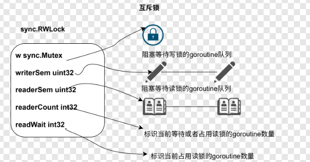
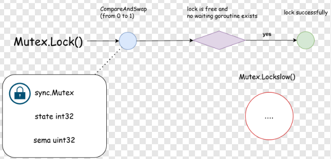

# 1 Mutex核心机制
```go
// map数据结构，不是并发安全的，所以我们基于Mutex对map进行保护，使其能被map使用方并发安全的使用到。

type MyConcurrentMap struct {
    sync.Mutex
    mp map[int]int
}

func NewConcurrentMap() *MyConcurrentMap {
    return &MyConcurrentMap {
        mp: make(map[int]int),
    }
}

func (m *MyConcurrentMap) Get (key int) (int, bool ) {
    // 并发的、自由的
    m.RWMutex.RLock()

    // 一次只有一个 goroutine 交互
    v, ok := m.mp[key]

    m.RWMutex.RUnlock()
    // 并发的、自由的
    return v, ok
}

func (m *MyConcurrentMap) Put (key, Val int) {
    m.Mutex.Lock()

    m.mp[key] = val

    m.Mutex.Unlock()
}

func (m *MyConcurrentMap) Delete (key int) {
    m.Mutex.Lock()
    delete(m.Metux.Unlock(m.mp, key))
    m.Mutex.Unlock()
}
```

## 1.1 上锁/解锁
锁的主干：通过Mutex内一个状态值锁的标志，如 0表示未加锁， 1表示已加锁  
* 上锁 0->1  解锁 1 -> 0  
* 上锁时，假若已经是1，则上锁失败，需要等他人解锁，将状态改为0  

## 1.2 由自旋到阻塞的升级过程
真的对 goroutine 加锁时发现锁已被抢占的这种情形， 有两种策略：  
**（1）阻塞/唤醒**： 将当前goroutine阻塞挂起，直到锁被释放后，以回调的方式将阻塞goroutine重新唤醒，进行锁争夺；  
* **优势：**  精准打击，不浪费CPU时间片  
* **劣势：**  需要挂起协程，进行上下文切换  
* **适用场景：** 并发竞争激烈的场景  

**（2）自旋+CAS**： 基于自旋结合CAS的方式，重复校验锁的状态并尝试获取锁，始终把主动权握在手中    
* **优势：**  无需阻塞协程，短期来看操作较轻  
* **劣势：**  长时间争而不得，会浪费CPU时间片  
* **适用场景：** 并发竞争强度低的场景  

sync.Mutex 结合两个方案的使用场景， 制定了一个锁升级的过程，反映了面对并发环境通过持续试探逐渐由乐观逐渐转为悲观的态度。 **具体方案如下：**  
  
* 首先保持乐观， goroutine采用自旋 + CAS 的策略争夺锁  
* 尝试持续受挫达到一定条件后，判定当前过于激烈，则由 自旋 转为 阻塞/挂起 模式。  

上面的自旋模式转为阻塞模式的具体条件拆解如下：  

* 自旋累计达到4次仍未取得战果；  
* CPU单核或仅有单个 P 调度器；（此时自旋，其他 goroutine 根本没机会释放锁，自旋纯属空转）；  
* 当前 P 的执行队列中仍有待执行的 G。（避免因自旋影响到GMP调度效率）  

## 1.3 饥饿模式  
由自旋到阻塞的升级策略主要面向性能问题，饥饿模式则是针对公平性问题。  

* **饥饿：**由于非公平机制的原因，导致Mutex阻塞队列中存在goroutine长时间取不到锁，从而陷入饥荒状态；  
* **饥饿模式：**当Mutex阻塞队列中存在处于饥饿态的goroutine时，会进入模式，将抢锁流程由非公平机制转为公平机制。  

在sync.Mutex 运行过程中存在两种模式：  

* 正常模式/非饥饿模式： sync.Mutex默认采用的模式，当有goroutine从阻塞队列被唤醒时，会和此时先进入抢锁流程的goroutine进行锁资源的争夺，假如抢锁失败，会重新回到阻塞队列头部。  
【此时被唤醒的老goroutine相比新goroutine是处于劣势地位的，因为新goroutine已经在占用CPU时间片，且新goroutine可能存在多个，从而形成多对一的人数优势，因此形式对老goroutine不利。】  

* 饥饿模式：sync.Mutex为拯救陷入饥荒的老goroutine而启用的特殊机制。饥饿模式下，锁的所有权按照阻塞队列的顺序进行依次传递，新goroutinee进行流程时不得抢锁，而是进入队列尾部排队。  

**两种模式的转换条件：**  
* 默认为正常模式；  
* 正常模式->饥饿模式： 当阻塞队列存在goroutine等锁超过1ms而不得，则进入饥饿模式；  
* 饥饿模式->正常模式： 当阻塞队列已经清空，或取得锁的goroutine等锁时间已低于1ms时，则回到正常模式。  
  
**conclusion：** 正常模式灵活机动，性能较好；饥饿模式严格死板，但能捍卫公平的底线。因此，两种模式的切换体现了sync.Mutex为适应环境变化，在公平与性能之间做出的调整与权衡。  

## 1.4 数据结构
```go
type Mutex struct {
    state int32
    sema unit32
}
```  
* state : 锁中最核心的状态字段，不同bit位分别存储了mutexLock（是否上锁）、mutexWoken（是否有goroutine从阻塞队列中被唤醒）、mutexStarving（是否处于饥饿模式）的信息。  
* sema ： 用于阻塞和唤醒goroutine的信号量

**几个全局变量**
```go
const (
    mutexLocked = 1 << iota // mutex is locked
    mutexWoken
    mutexStarving
    mutexWaiterShift = iota

    starvationThresholdNs = 1e6
)
```
* mutexLocked = 1 : state 最右侧的一个bit位标志是否上锁， 0-未上锁， 1-已上锁；  
* mutexWoken = 2 ： state 右往左数第二个bit位标志是否有goroutine从阻塞中被唤醒，0-没有，1-有  
* mutexStarving = 4 ： state 右往左数第三个bit位标志Mutex是否处于饥饿模式， 0-非饥饿，1-饥饿；  
* mutexWaiterShift = 3 ： 右侧存在3个bit位标志特殊信息，分别为上述的mutexLocked、mutexWoken、mutexStarving  
* starvationThresholds = 1ms ： sync.Mutex进入饥饿模式的等待时间阈值。  

**state字段详述**  
Mutex.state 字段为 int32 类型，不同bit位具有不同的标识含义：
  
低3位分别标识mutexLocked（是否上锁）、mutexWoken（是否有协程在抢锁）、  
mutexStarving（是否处于饥饿模式），高29位的值聚合为一个范围为0~2^29-1的整数，表示在阻塞队列中等待的协程个数。  
  
在加锁/解锁处理流程中，会频繁借助位运算从Mutex.state字段中快速获取到以上信息，  
* state & mutexLocked : 判断是否上锁  
* state | mutexLocked : 加锁  
* state & mutexWoken ： 判断是否存在抢锁的协程  
* state | mutexWoken ： 更新状态，表示存在抢锁的协程  
* state &^ mutexWoken ： 更新状态，表示不存在抢锁的协程  
（&^ 与或 x&^Y ： y=1时结果为0， y=0结果为x）  
* state & mutexStarving : 判断是否处于饥饿模式  
* state | mutexStarving ： 置为饥饿模式  
* state >> mutexWaitShif : 获取阻塞等待的协程数  
* state += 1 << mutexWaitShif : 阻塞等待的协程数+1  

## 1.5 Mutex.Lock()

### 1.5.1 Lock方法主干

```go
func (m *Mutex) Lock() {
    if atomic.CompareAndSwapInt32(&m.state, 0, mutexLocked) {
        return
    }
    // slow path (outlined so that the fast path can be inlined )
    m.lockSlow()
}
```
* 首先进入一轮CAS操作，假如当前未上锁且锁内不存在阻塞协程，则直接CAS抢锁成功返回；  
* 第一轮初探失败，则进入lockSlow流程  

### 1.5.2 Mutex.lockSlow()

**几个局部变量**
```go
func (m *Mutex) lockSlow() {
    var waitStartTime int64
    starving := false
    awoke := false
    iter := 0
    old := m.state
    // ...
}
```  
* WaitStartTime: 表示当前goroutine在抢锁过程中的等待时长，单位：ns  
* starving： 表示当前是否处于饥饿模式  
* awoke： 表示当前是否已经有协程在等锁  
* iter： 表示当前goroutine参与自旋的次数  
* old： 临时存储锁的state值  

**自旋空转**

```go
func (m *Mutex) lockSlow() {
    // ...variable
    for {
        // 进入该if分支，说明抢锁失败，但处于正常模式，且仍然满足自旋条件
        if old&(mutexLocked|mutexStarving) == mutexLocked && runtimr_canSpain(iter) {
            // 进入该 if 分支，说明当前锁阻塞队列有协程，但还未被唤醒，因此需要将
            // mutexWoken 标识置为 1，避免再有其他协程被唤醒和自己抢锁。
            if !awoke && old&mutexWoken == 0 && old >> mutexWaitShift != 0 &&atomic.CompareAndSwapInt32(&m.state, old, old||mutexWoken) {
                awoke = true
            }
            runtime_doSpin()
            iter++
            old = m.state
            continue
        }
        // ...
    }
    
}
```
* 走进for循环；  
* 假如满足三个条件： I锁已被占用、II锁为正常状态、III满足自旋条件（runtime_canSpin方法），则进入自旋后处理环节；  
* 在自旋后处理中，假如当前锁有尚未唤醒的阻塞协程，则通过CAS操作将 state 的 mutexWoken 标识置为1，将局部变量 awoke 置为 true；  
* 调用runtime_doSpin告知调度器 P 当前处于自旋模式；  
* 更新自旋次数iter 和锁状态值 old；  
通过 continue 语句进入下一轮尝试；  

**state新值构造**
```go
func (m *Mutex) lockSlow() {
    // ...
    for {
        // 自旋抢锁失败后处理...

        new := old
        if old&mutexStarving == 0 {
            // 非饥饿状态，该goroutine尝试抢锁
            new |= mutexLocked
        }
        if old&(mutexLocked|mutexStarving) != 0 {
            // 旧值已处于加锁或者饥饿状态，当前goroutine在这一轮注定无法抢锁成功
            // 直接令新锁的阻塞协程数+1
            new += 1 << mutexWaiterShift
        }
        if starving && old&mutexLock != 0 {
            // 当前协程因等待超时需要触发饥饿模式且旧值已加锁，则将新值置为饥饿模式
            new |= mutexStarving
        }
    }
}
```
* 从自旋中走出来后，会存在两种分支，要么加锁成功，要么陷入饥饿模式。无论处于何种情形，都会先对sync.Mutex的状态新值进行更新；  
* 倘如当前是非饥饿模式，则新值new中置为已加锁，即尝试抢锁；  
* 倘若旧值为已加锁或者处于饥饿模式，则当前goroutine在这一轮注定无法抢锁成功，可以直接令新锁的阻塞协程数+1；  
* 倘若当前进入饥饿模式且旧值已加锁，则将新值置为饥饿模式；  
* 倘若局部变量标识是已有唤醒协程抢锁，说明Mutex.state中的mutexWoken是被当前goroutine置为1的，但由于当前goroutine接下来要么抢锁成功，要么被阻塞挂起，因此需要在新值中将该mutexWoken标识更新置0.  

**state新旧值替换**  
```go
func (m *Mutex) lockSlow() {
    // ...
    for {
        // 自选抢锁失败后处理 ...

        // new old 状态值更新 ...

        if atomic.CompareAndSwapInt32(&m.state, old, new) {
            // case1 加锁成功
            // case2 将当前协程挂起

            // ...
        } else {
            old = m.state
        }
        // ...
    }
}
```
* 通过CAS操作，用构造的新值替换旧值；  
* 倘若失败（即旧值被其他协程介入提前修改导致不符合预期），则将旧值更新为此刻的Mutex.state，并开启一轮新的循环。  
* 倘若CAS替换成功，则进入最后一轮二选一局面： I 倘若当前goroutine加锁成功，则返回； II倘若失败，则将goroutine挂起添加到阻塞队列。  

**上锁成功分支**  
```go
func (m *Mutex) lockSlow() {
    // ...
    for {
        // 自旋抢锁失败后处理 ...

        // new old 状态值更新 ...

        if atomic.CompareAndSwapInt32(&m.state, old, new) {
            if old&(mutexLocked|mutexStarving) == 0 {
                break
            }
            // ..
        }
        // ...
    }
}
```
* 此时已经成功将Mutex.state由旧值替换为新值；  
* 接下来进行判断，倘若旧值是未加锁状态且为正常模式，则意味着加锁标识位正是由当前goroutine完成的更新，说明加锁成功，返回即可；  
* 倘若旧值中锁未释放或者处于饥饿模式，则当前goroutine需要进入阻塞队列挂起。

**阻塞挂起**
```go
func (m *Mutex) lockSlow() {
    // ...
    for {
        // 自旋抢锁失败后处理 ...

        // new old 状态值更新 ...

        if atomic.CompareAndSwapInt32(&m.state, old, new) {
            // 加锁成功后返回的逻辑分支

            queueLifo := waitStartTime != 0 
            if waitStartTime == 0 {
                waitStartTime = runtime_nanotime()
            }
            runtime_SemacquireMutex(&m.sema, queueLifo, 1)
        }
    }
}
```
走到此处的情形有两种：要么抢锁失败，要么是锁已处于饥饿模式，而当前goroutine不是从阻塞队列被唤醒的协程，不论处于哪种情形，当前goroutine都面临被阻塞挂起的命运。  
* 基于 queueLifo 标识当前goroutine是从阻塞队列被唤起的老客还是新进入流程的新客；  
* 倘若等待的起始时间为0，则为新客，反之；  
* 倘若是新客，则对等待的起始时间进行更新，置为当前时刻的ns时间戳；  
* 将当前协程添加到阻塞队列中，倘若是老客则挂入队头，倘若是新客，则挂入队尾；  
* 挂起当前协程

**从阻塞态被唤醒**
```go
func (m *Mutex) lockSlow() {
    // ... 
    for {
        // 自旋抢锁失败后处理 ...

        // new old 状态值更新 ...

        if atomic.CompareAndSwapInt32(&m.state, old, new) {
            // 加锁成功后返回逻辑分支 ...

            // 挂起前处理 ...
            runtime_SemaquireMutex(&m.sema, queueLifo, 1)
            // 从阻塞队列被唤醒 
            starving = starving || runtime_nanotime()-waitStarTime > starvationThresholdNs  
            old = m.state
            if old&mutexStarving != 0 { // 判断是否处于饥饿模式
                delta := int32(mutexLocked - 1<<mutexWaiterShift)
                if !starving || old>>mutexWaiterShift == 1 { // 当前协程未超时或只剩一个等待者
                    delta -= mutexStarving // 消除饥饿模式
                }
                atomic.AddInt32(&m.state, delta)
                break
            }

            awoke = true
            iter = 0
        }
        // ...
    }
}
```
* 走到此处，说明当前goroutine是从Mutex的阻塞队列中被唤起的；  
* 判断一下，此刻需要进入阻塞态，倘若当前goroutine进入阻塞队列时间长达1ms，则说明需要；此时会更新starving局部变量，并在下一轮循环中完成对Metux.state中starving标识位的更新；  
* 获取此时锁的状态，通过old存储；  
* 倘若此时锁是饥饿模式，则当前goroutine无需竞争可以直接获得锁；  
* 饥饿模式下，goroutine获取锁需要更新锁的状态，包含mutexLocked、锁阻塞队列等待协程数以及mutexStarving三个信息；均通过delta变量记录差值，最终通过原子操作添加到Mutex.state中；  
* mutexStarving的更新要做前置判断，倘若当前，倘若当前局部变量starving为false，或者当前goroutine就是Mutex阻塞队列的最后一个goroutine，则将Mutex.state置为正常模式。  

## 1.6 MutexUnlock()

```go
func (m *Mutex) Unlock() {
    new := atomic.AddInt32(&m.state, -mutexLocked)
    if new != 0 {
        m.unlockSlow(new)
    }
}
```
* 通过原子操作解锁；  
* 倘若解锁时发现，目前参与竞争的仅有自身一个goroutine，则直接返回即可；  
* **倘若发现锁中还有阻塞协程，则走入unlockSlow()分支。**  

**unlockSlow**

**（1）未加锁的异常情形**
```go
func (m *Mutex) unlockSlow(new int32) {
    if (new+mutexLocked)&mutexLocked == 0 {
        fatal("sync: unlock of unlocked mutex")
    }
    // ...
}
```
解锁时倘若发现Mutex此前未加锁，直接抛出fatal.

**(2)正常模式**
```go
func (m *Mutex) unlockSlow(new int32) {
    // .....
    if new&mutexStarving ==  0 {
        old := new
        for {
            if old >> mutexWaiterShift == 0 || old&(mutexLocked|mutexWoken|mutexStarving) != 0 {
                return
            }
        }

        new = (old - 1<<mutexWaiterShift) | mutexWoken
        if atomic.CompareAndSwapInt32(&m.state, old, new) {
            runtime_Semrelease(&m.sema, false,1)
            return
        }
        old = m.state
    }
    // .....
}
```
* 倘若阻塞队列内无goroutine或者mutexLocked、mutexStarving、mutexWoken标识位任一不为0，三者均说明此时有其他活跃协程已介入，自身无需关心后续流程；  
* 基于CAS操作将Mutex.state中的阻塞协程数-1，设置唤醒标志，倘若成功，则唤起阻塞队列头部的goroutine，并退出；  
* 倘若减少阻塞协程数的CAS操作失败，则更新此时的Mutex.state为新的old值，开启下一轮循环。

**（3）饥饿模式**
```go
func (m *Mutex) unlockSLow (new int32) {
    // ...
    if new&mutexStarving == 0 {
        // ...
    } else {
        runtime_Semrelease(&m.sema, true, 1)
    }
}
```
* 饥饿模式下，直接唤醒阻塞队列头部的goroutine即可。